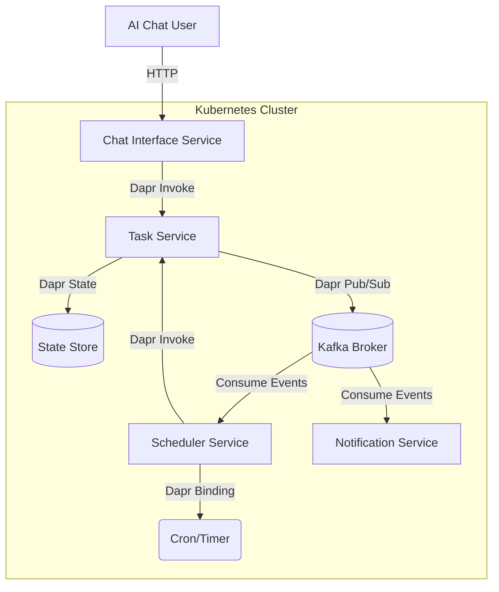

# Research & Architecture: Advanced Cloud-Native Deployment

**Feature**: `006-advanced-cloud-deployment`
**Date**: 2026-02-09

## Key Decisions

### 1. Persistence & Query Strategy
**Problem**: The system requires "Search, filter, and sort" (FR-004), but the Constitution mandates "Dapr must be used for... State management". Dapr State is primarily Key-Value, which makes complex querying difficult.

**Options**:
1.  **Dapr State API only**: Use KV store. Scan all keys for filtering (Inefficient, hard to sort).
2.  **Dapr Query State API (Alpha)**: Use Dapr's query capability on supported stores (Redis, MongoDB, Postgres).
3.  **CQRS Pattern**: Task Service uses Dapr KV for writes. A separate "Search Service" consumes events and builds a searchable index (e.g., in-memory or embedded Lucene/SQL).
4.  **Internal Database**: Task Service uses a private SQL database (via JDBC/ODBC) behind the scenes, ignoring Dapr for *internal* storage but using Dapr for *external* state sharing.

**Decision**: **Option 2 (Dapr Query State API)** with **Option 1 (KV)** as fallback/hybrid.
**Rationale**:
- Complies strictly with "Application services must depend only on Dapr APIs".
- Dapr Query API supports filtering and sorting on JSON values.
- We will configure the underlying Dapr State Component to be **Redis** (Local) and **Azure CosmosDB / GCP Firestore / Managed Redis** (Cloud), which support querying.
- If Query API proves too unstable (Alpha), we will implement a lightweight in-memory index in the Task Service for the scale of a Todo app, populated on startup/events.

### 2. Service Decomposition
**Problem**: How to split the monolith into "Single Responsibility" services.

**Decision**:
- **Chat Interface Service**:
    - **Role**: API Gateway for the AI Chatbot.
    - **Responsibility**: NLP intent parsing (via Gemini/LLM), routing commands to Task Service.
    - **Communication**: Uses Dapr Service Invocation (HTTP) to call Task Service synchronously for user feedback.
- **Task Service**:
    - **Role**: Domain Core.
    - **Responsibility**: CRUD logic, State Management (Dapr State), Event Emission (Dapr Pub/Sub).
    - **Data**: Owns the "Tasks" state store.
- **Scheduler Service**:
    - **Role**: Timekeeper.
    - **Responsibility**: Manages Dapr Bindings (Cron) for recurrence and reminders.
    - **Action**: Consumes `TaskCreated`/`TaskScheduled` events. Invokes Task Service or emits `ReminderDue` events when time comes.
- **Notification Service**:
    - **Role**: Output.
    - **Responsibility**: Consumes `ReminderDue` events and formats/sends them (mocked as logs/console for now).

### 3. Deployment & Configuration
**Problem**: Parity between Minikube and Cloud without code changes.

**Decision**:
- **Helm Charts**: Single chart `todo-app` with sub-charts or multiple deployment manifests.
- **Dapr Components**:
    - `statestore.yaml`:
        - Local: `type: state.redis`, `host: redis-master:6379`
        - Cloud: `type: state.redis` (Managed) or `state.azure.cosmosdb`.
    - `pubsub.yaml`:
        - Local: `type: pubsub.kafka`, `brokers: my-cluster-kafka-bootstrap:9092`
        - Cloud: `type: pubsub.kafka` (Managed/Strimzi).
- **Secrets**:
    - Usage of `dapr.io/enabled: "true"` annotation.
    - Secrets accessed via Dapr Secrets API (abstraction over K8s Secrets).

## Architecture Diagram (Mermaid)

## Technology Stack (Refined)
- **Language**: Python 3.10+ (FastAPI for services).
- **Dapr SDK**: `dapr-python-sdk`.
- **Image**: `python:3.10-slim`.
- **Orchestration**: Helm v3.
- **Local Dev**: Minikube + Skaffold (optional) or plain `kubectl`.

## Outstanding Questions & Risks
- **Risk**: Dapr Query API is Alpha.
- **Mitigation**: If it fails, fallback to fetching all tasks for a user (ID prefix scan) and filtering in memory (Python). Given it's a Todo app, N is small (<10k).

## Needs Clarification Resolution
- *None pending*. Assumptions made on Database (Dapr State) and Auth (Single User/Implicit).
